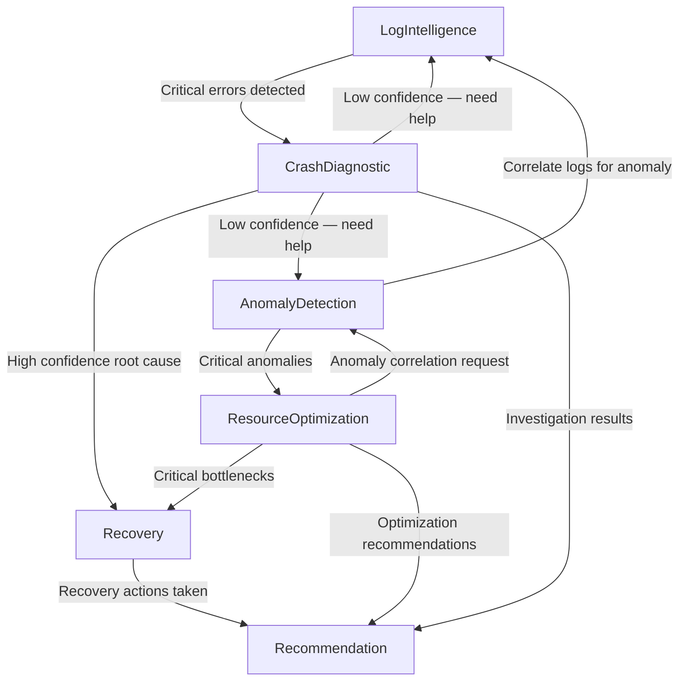

# HelixAI — Multi-Agent Cloud Intelligence Platform

> An AI-powered, multi-agent system for real-time cloud infrastructure monitoring, log analysis, anomaly detection, and automated recovery — built with Node.js, React, and LangChain.

---

## Table of Contents

1. [Overview](#overview)
2. [System Architecture](#system-architecture)
3. [Tech Stack](#tech-stack)
4. [Backend Deep Dive](#backend-deep-dive)
   - [Directory Structure](#backend-directory-structure)
   - [Agent System](#agent-system)
   - [Agent Orchestrator](#agent-orchestrator)
   - [Inter-Agent Communication](#inter-agent-communication)
   - [LLM Integration (LangChain)](#llm-integration-langchain)
   - [AWS CloudWatch Integration](#aws-cloudwatch-integration)
   - [Data Models](#data-models)
   - [REST API Endpoints](#rest-api-endpoints)
5. [Frontend Deep Dive](#frontend-deep-dive)
6. [Data Flow: End-to-End Example](#data-flow-end-to-end-example)
7. [Setup & Running](#setup--running)
8. [Environment Variables](#environment-variables)

---

## Overview

HelixAI is a **multi-agent AI system** designed to monitor and manage cloud infrastructure autonomously. Instead of relying on static rules and dashboards, HelixAI deploys **7 specialized AI agents** that collaborate, communicate, and coordinate through a central orchestrator to:

- **Ingest real logs** from AWS CloudWatch
- **Analyze** them using rule-based heuristics + LLM-powered semantic analysis
- **Detect anomalies** using statistical methods (z-score, trend detection)
- **Diagnose crashes** by parsing stack traces and correlating errors across services
- **Auto-recover** by executing healing actions (restart, scale, rollback) with safety checks
- **Optimize costs** and **generate recommendations** for infrastructure improvements

The system is built for **multi-tenancy** — each company gets its own agent instances, credentials, and configurations.

---

## System Architecture

```
┌─────────────────────────────────────────────────────────────────────────────┐
│                              FRONTEND (React + Vite)                       │
│                                                                             │
│   ┌──────────┐ ┌──────────┐ ┌──────────┐ ┌──────────┐ ┌─────────────────┐ │
│   │Dashboard │ │ Agents   │ │Incidents │ │Workflows │ │ CloudWatch Logs │ │
│   └────┬─────┘ └────┬─────┘ └────┬─────┘ └────┬─────┘ └───────┬─────────┘ │
│        │             │            │             │               │           │
│        └─────────────┴────────────┴─────────────┴───────────────┘           │
│                          │ Axios (REST)           │ Socket.IO (Real-time)   │
└──────────────────────────┼───────────────────────┼──────────────────────────┘
                           │                       │
┌──────────────────────────┼───────────────────────┼──────────────────────────┐
│                          ▼                       ▼       BACKEND (Node.js)  │
│   ┌──────────────────────────────────────────────────────────────────────┐  │
│   │                        Express REST API                              │  │
│   │   /api/auth  /api/company  /api/agents  /api/cloudwatch  /api/...    │  │
│   └──────────────────────────────┬───────────────────────────────────────┘  │
│                                  │                                          │
│   ┌──────────────────────────────▼───────────────────────────────────────┐  │
│   │                      AGENT ORCHESTRATOR                              │  │
│   │           Central coordinator for all 7 agents                       │  │
│   │   • Routes messages between agents (via RabbitMQ)                    │  │
│   │   • Manages agent lifecycle & workflows                              │  │
│   │   • Executes multi-step collaborative workflows                      │  │
│   └──────┬──────┬──────┬──────┬──────┬──────┬──────┬─────────────────────┘  │
│          │      │      │      │      │      │      │                        │
│   ┌──────▼──┐┌──▼───┐┌─▼────┐┌▼─────┐┌─▼───┐┌─▼───┐┌▼─────┐               │
│   │  Log    ││Crash ││Rsrc  ││Anomly││Recov││Recom││ Cost │               │
│   │  Intel  ││Diag  ││Optim ││Detct ││ Agent││Agent││Optim │               │
│   └────┬────┘└──┬───┘└──┬───┘└──┬───┘└──┬──┘└──┬──┘└──┬───┘               │
│        │        │       │       │       │      │      │                     │
│        └────────┴───────┴───────┴───────┴──────┴──────┘                     │
│                         │                                                   │
│              ┌──────────▼──────────┐                                        │
│              │   LangChain (LLM)   │                                        │
│              │ Gemini│Claude│GPT│Groq                                       │
│              └─────────────────────┘                                        │
│                                                                             │
│   ┌─────────────┐  ┌──────────────┐  ┌───────────────┐  ┌───────────────┐  │
│   │  MongoDB    │  │    Redis     │  │   RabbitMQ    │  │  AWS SDK      │  │
│   │ (Persistent │  │(Agent State, │  │(Agent-to-Agent│  │(CloudWatch    │  │
│   │  Storage)   │  │  Pub/Sub)    │  │  Messaging)   │  │  Log Fetch)   │  │
│   └─────────────┘  └──────────────┘  └───────────────┘  └───────────────┘  │
└─────────────────────────────────────────────────────────────────────────────┘
```

---

## Tech Stack

| Layer | Technology | Purpose |
|-------|-----------|---------|
| **Frontend** | React 19 + Vite | SPA with real-time updates |
| **Styling** | Tailwind CSS 3 | Dark-themed modern UI |
| **Charts** | Recharts | Dashboard visualizations |
| **Real-time** | Socket.IO Client | Live agent state updates |
| **Backend** | Node.js + Express | REST API server |
| **AI/LLM** | LangChain | Multi-provider LLM abstraction |
| **LLM Providers** | Google Gemini, OpenAI GPT, Anthropic Claude, Groq | Pluggable AI models |
| **Database** | MongoDB + Mongoose | Primary data store (logs, incidents, agents, companies) |
| **Cache/PubSub** | Redis | Agent state caching + real-time event pub/sub |
| **Message Queue** | RabbitMQ (AMQP) | Async inter-agent message routing |
| **Cloud SDK** | @aws-sdk/client-cloudwatch-logs | Real AWS CloudWatch log ingestion |
| **Auth** | JWT + bcrypt | Token-based authentication |
| **Encryption** | AES-256-GCM | Encrypts all stored API keys & credentials |
| **WebSocket** | Socket.IO Server | Pushes agent state changes to frontend |

---

## Backend Deep Dive

### Backend Directory Structure

```
backend/
├── server.js                          # Entry point — boots DB, Redis, RabbitMQ, WebSocket
├── .env                               # Environment variables
├── package.json
└── src/
    ├── app.js                         # Express app with all route registrations
    ├── agents/
    │   ├── base/
    │   │   └── BaseAgent.js           # Abstract base class for all agents
    │   ├── LogIntelligenceAgent.js     # Log analysis agent
    │   ├── CrashDiagnosticAgent.js     # Crash investigation agent
    │   ├── ResourceOptimizationAgent.js # Resource monitoring agent
    │   ├── AnomalyDetectionAgent.js    # Statistical anomaly detection
    │   ├── RecoveryAgent.js            # Auto-healing agent
    │   ├── RecommendationAgent.js      # Insight generation agent
    │   └── CostOptimizationAgent.js    # Cost analysis agent
    ├── config/
    │   ├── database.js                # MongoDB connection
    │   ├── redis.js                   # Redis client + agent state ops + pub/sub
    │   ├── rabbitmq.js                # RabbitMQ connection + agent queues
    │   └── langchain.js               # LLM provider factory (Gemini/GPT/Claude/Groq)
    ├── controllers/                   # REST endpoint handlers
    ├── middleware/                     # Auth, validation, error handling
    ├── models/                        # Mongoose schemas (Company, User, Agent, LogEntry, etc.)
    ├── orchestrator/
    │   └── AgentOrchestrator.js       # Central agent coordinator
    ├── routes/                        # Express route definitions
    ├── services/
    │   └── awsCloudWatchService.js    # AWS CloudWatch fetch + intelligent filtering
    ├── utils/                         # Logger, encryption, helpers
    └── websocket/
        └── socketHandler.js           # Socket.IO server + Redis event bridging
```

---

### Agent System

HelixAI has **7 specialized agents**, each extending a common `BaseAgent` class. Every agent has:

- **State management** — persisted to Redis, broadcast via WebSocket to the UI in real-time
- **LLM integration** — each agent has a custom system prompt and can query the configured LLM
- **Memory** — agents remember past actions and outcomes to improve future decisions
- **Inter-agent messaging** — agents can send direct messages, broadcast, or request collaborative help

#### The 7 Agents

| # | Agent | Role | Key Capabilities |
|---|-------|------|-------------------|
| 1 | **📊 LogIntelligence** | Log Analyzer | Categorizes logs by severity, detects time/service/keyword patterns, extracts error signatures, LLM semantic analysis |
| 2 | **🔍 CrashDiagnostic** | Crash Investigator | Parses stack traces, finds root causes, correlates errors across services, checks known issue database, creates incidents |
| 3 | **⚡ ResourceOptimization** | Resource Monitor | Monitors CPU/memory/disk metrics, detects bottlenecks, recommends scaling, continuous monitoring loop |
| 4 | **🎯 AnomalyDetection** | Anomaly Detector | Z-score statistical detection, trend analysis (linear regression), pattern recognition, failure prediction |
| 5 | **🔄 Recovery** | Auto-Healer | Executes recovery actions (restart, scale-up, scale-out, rollback, failover), takes snapshots before changes, health checks after, automatic rollback on failure |
| 6 | **💡 Recommendation** | Insight Generator | Aggregates findings from all agents, generates actionable recommendations |
| 7 | **💰 CostOptimization** | Cost Analyzer | Analyzes resource costs, identifies underutilized resources, suggests right-sizing |

#### BaseAgent (Abstract Class)

Every agent inherits from `BaseAgent`, which provides:

```
BaseAgent
├── initialize()           → Restore state from Redis
├── process(data)          → ABSTRACT — each agent implements this
├── updateState(updates)   → Persist state to Redis + emit WebSocket event
├── sendMessage(target, msg) → Send message to another agent via RabbitMQ
├── broadcast(msg)         → Broadcast to all agents
├── requestHelp(agents, query) → Collaborative multi-agent query
├── queryLLM(prompt, context)  → Query the configured LLM with agent-specific system prompt
├── storeMemory(event)     → Store event in agent memory (auto-pruned by importance)
├── executeWithTracking()  → Wraps actions with state tracking, error handling, and metrics
├── calculateConfidence()  → Weighted confidence scoring
└── retry(fn, maxRetries)  → Exponential backoff retry logic
```

---

### Agent Orchestrator

The `AgentOrchestrator` is the **central brain** that:

1. **Initializes all 7 agents** for a given company
2. **Routes messages** between agents via RabbitMQ
3. **Executes workflows** — multi-step sequences of agent actions with conditions, timeouts, and error handling
4. **Manages lifecycle** — starts, monitors, and shuts down agents

It operates as a **singleton per company** — each company gets its own orchestrator instance with its own set of agents.

```
AgentOrchestrator
├── initialize()              → Create & init all 7 agents
├── routeMessage(from, to)    → Route message via RabbitMQ
├── broadcastMessage(from)    → Send to all agents
├── collaborativeQuery(agents, query) → Query multiple agents in parallel
├── executeWorkflow(name, data)       → Run multi-step agent pipeline
├── getAgentsStatus()         → Get all agent states
└── shutdown()                → Graceful shutdown
```

---

### Inter-Agent Communication

Agents collaborate autonomously through a sophisticated messaging system:



**Communication channels:**

| Channel | Technology | Purpose |
|---------|-----------|---------|
| **RabbitMQ** | AMQP queues | Async, persistent inter-agent messages with topic routing |
| **Redis Pub/Sub** | Redis channels | Real-time agent state events → WebSocket → Frontend |
| **Direct** | In-memory orchestrator | Synchronous collaborative queries |

**Decision tree example (CrashDiagnostic):**
- **Confidence > 80%** → Send root cause to **Recovery Agent** for auto-healing
- **Confidence 50-80%** → Request help from **LogIntelligence** + **AnomalyDetection**
- **Confidence < 50%** → Create incident for **human review**

---

### LLM Integration (LangChain)

HelixAI uses LangChain as an abstraction over multiple LLM providers:

```
langchain.js
├── createLLM(provider, model, apiKey) → Factory for 4 providers
│   ├── OpenAI     → ChatOpenAI (gpt-4o-mini, etc.)
│   ├── Google     → ChatGoogleGenerativeAI (gemini-2.0-flash, etc.)
│   ├── Anthropic  → ChatAnthropic (claude-3.5-sonnet, etc.)
│   └── Groq       → ChatGroq (llama-3.3-70b-versatile, etc.)
├── getLLMForCompany(companyId) → Loads active config, decrypts key, creates/caches LLM
├── queryLLM(system, user, opts) → SystemMessage + HumanMessage → LLM.invoke()
└── queryLLMStructured(...)     → Structured output with schema validation
```

**Multi-tenant design**: Each company can configure different LLM providers. The system:
1. Looks up the company's active LLM configuration from MongoDB
2. Decrypts the API key using AES-256-GCM
3. Creates a provider-specific LLM instance (cached for 5 min)
4. Falls back to environment variable if no config exists

---

### AWS CloudWatch Integration

The `awsCloudWatchService.js` connects to real AWS CloudWatch using the company's stored (encrypted) AWS credentials:

```
awsCloudWatchService.js
├── listLogGroups(credentials)              → Lists all CloudWatch log groups
├── fetchLogs(credentials, logGroup, opts)  → Fetches raw log events with pagination
└── filterAndGroupLogs(rawLogs, opts)       → Intelligent pre-processing pipeline
```

**Intelligent Log Filtering Pipeline** (scalability design):

```
    5000 raw CloudWatch logs
            │
     ┌──────┴──────┐
     │ Tier Split   │
     └──────┬──────┘
            │
    ┌───────┼──────────┐
    ▼       ▼          ▼
 CRITICAL  WARNING    NOISE
 (error,   (warn)     (info, debug)
  fatal)
    │       │          │
    │   Group by    Sample 1
   Keep  signature   per unique
    ALL   (top 50)   pattern
    │       │          │
    └───────┼──────────┘
            ▼
    ~60 important logs
    fed to AI agent
    (98.8% noise reduction)
```

**Signature-based deduplication**: Messages like `"Connection timeout after 3012ms"` and `"Connection timeout after 7844ms"` collapse into the same group by stripping numbers, timestamps, and hex IDs.

---

### Data Models

| Model | Purpose | Key Fields |
|-------|---------|------------|
| **Company** | Multi-tenant root entity | AWS credentials (encrypted), LLM configs (encrypted), infrastructure settings, agent settings |
| **User** | Authentication | Email, password (bcrypt), role (admin/user), belongs to Company |
| **Agent** | Agent metadata | Name, type, status, configuration |
| **AgentState** | Runtime state | Status, metrics, confidence, memory |
| **LogEntry** | Stored logs | Timestamp, level, message, source, parsed error info, AI analysis |
| **Incident** | Created issues | Severity, status, root cause, timeline, actions taken |
| **Anomaly** | Detected anomalies | Metric, type (spike/dip/trend), severity, detection method |
| **Resource** | Cloud resources | Type (EC2/RDS/etc.), metrics (CPU/memory/disk), health status |
| **Recovery** | Auto-healing records | Action type, target, risk level, approval status, snapshot, health check |
| **Workflow** | Agent pipelines | Steps (agent + action), conditions, input/output mapping |
| **WorkflowExecution** | Pipeline runs | Status, step results, duration |
| **Message** | Inter-agent messages | From, to, type, payload, priority |
| **Recommendation** | AI suggestions | Category, priority, estimated impact |
| **CostAnalysis** | Cost reports | Period, total cost, breakdown, savings opportunities |

---

### REST API Endpoints

| Route Group | Key Endpoints |
|-------------|---------------|
| **`/api/auth`** | `POST /login`, `POST /register`, `GET /me` |
| **`/api/company`** | `GET /`, `PUT /`, `POST /aws-credentials`, `POST /llm-configs`, `PUT /llm-configs/active` |
| **`/api/agents`** | `GET /`, `GET /states`, `POST /initialize`, `POST /trigger` |
| **`/api/cloudwatch`** | `GET /log-groups`, `POST /logs` (fetch+filter), `POST /analyze` (fetch+filter+AI) |
| **`/api/incidents`** | `GET /`, `GET /:id`, `PUT /:id`, `GET /stats` |
| **`/api/workflows`** | `GET /`, `POST /`, `POST /graph`, `POST /:id/execute`, `GET /executions` |
| **`/api/dashboard`** | `GET /overview`, `GET /metrics`, `GET /agent-performance`, `GET /cost` |

---

## Frontend Deep Dive

| Page | Route | Purpose |
|------|-------|---------|
| **Dashboard** | `/` | System overview — agent stats, incident counts, resource health, recent activity, trend charts |
| **Agents** | `/agents` | View all 7 agents, their status, confidence gauges, metrics. Click to view details. Trigger agents manually. |
| **Incidents** | `/incidents` | List of auto-created incidents, severity filtering, status tracking |
| **Workflows** | `/workflows` | Create and manage multi-step agent workflows with drag-and-drop builder |
| **CloudWatch Logs** | `/logs` | **Select log group → fetch filtered logs → view grouped results → one-click AI analysis** |
| **Settings** | `/settings` | Configure AWS credentials, manage multiple LLM providers (Gemini/GPT/Claude/Groq), agent thresholds |
| **Login/Register** | `/login`, `/register` | JWT-based authentication |

**Real-time updates**: Agent state changes flow through Redis → WebSocket → Socket.IO to the frontend. When an agent changes status (idle → working → error), the UI updates instantly without polling.

---

## Data Flow: End-to-End Example

Here's what happens when a user clicks **"Analyze with AI"** on the CloudWatch Logs page:

```
1. USER clicks "Analyze with AI" on /logs page
       │
2. Frontend calls POST /api/cloudwatch/analyze
   Body: { logGroupName: "/aws/ec2/my-app", startTime: ..., endTime: ... }
       │
3. cloudwatchController.analyzeLogs():
   ├── Loads Company from MongoDB
   ├── Calls company.getAwsCredentials() → decrypts AES-256-GCM → { accessKeyId, secretAccessKey, region }
       │
4. awsCloudWatchService.fetchLogs():
   ├── Creates CloudWatchLogsClient with decrypted credentials
   ├── Calls FilterLogEvents API (paginates up to limit)
   ├── Parses each event → { timestamp, message, level, source }
   └── Returns 5000 raw log events
       │
5. awsCloudWatchService.filterAndGroupLogs():
   ├── Separates into tiers: 80 critical, 400 warnings, 4520 info/debug
   ├── Groups warnings by signature → 35 unique patterns
   ├── Samples info → 20 unique patterns
   └── Returns: important (80 critical + 35 warning samples = 115 logs)
       │
6. AgentOrchestrator.getAgent('LogIntelligence')
       │
7. LogIntelligenceAgent.process({ action: 'analyze', data: { logs: [115 logs] } }):
   ├── executeWithTracking() → updates state to "working" (→ Redis → WebSocket → UI)
   ├── categorizeLogs() → { errors: 80, warnings: 35, info: 0 }
   ├── extractErrors() → groups by error signature, sorts by frequency
   ├── detectPatterns() → time spikes, service patterns, keyword patterns
   ├── getLLMInsights():
   │   ├── langchain.queryLLM() → loads company's active Gemini config
   │   ├── Sends SystemMessage (agent prompt) + HumanMessage (error summary)
   │   └── Returns structured JSON analysis from Gemini
   ├── calculateSeverity() → "critical" (80 errors > 50 threshold)
   ├── Sends message to CrashDiagnostic agent (via RabbitMQ) for investigation
   ├── storeMemory() → saves analysis outcome for learning
   └── Updates state to "idle" (→ Redis → WebSocket → UI)
       │
8. Response returned to frontend with:
   ├── analysis: { severity, patterns, llmInsights, confidence, errors }
   ├── grouped: { critical: {...}, warnings: {...}, info: {...} }
   └── meta: { totalRaw: 5000, totalImportant: 115, reductionRatio: "97.7%" }
       │
9. Frontend renders:
   ├── Severity badge, confidence score, noise reduction ratio
   ├── Detected patterns list
   ├── LLM insights panel
   ├── Critical error log entries
   └── Warning groups (with occurrence count)
```

---

## Setup & Running

### Prerequisites

- **Node.js** ≥ 18
- **MongoDB** (running locally or Atlas)
- **Redis** (optional — gracefully degrades without it)
- **RabbitMQ** (optional — gracefully degrades without it)
- An **AWS account** with IAM user having CloudWatch read permissions
- An **LLM API key** (Gemini, OpenAI, Claude, or Groq)

### Installation

```bash
# Clone the repo
git clone <repository-url>
cd HelixAI

# Install backend dependencies
cd backend
npm install

# Install frontend dependencies
cd ../frontend
npm install
```

### Running

```bash
# Terminal 1 — Backend
cd backend
npm run dev          # Starts on http://localhost:5000

# Terminal 2 — Frontend
cd frontend
npm run dev          # Starts on http://localhost:5173
```

### First-time Setup (in the UI)

1. **Register** a new account at `/register`
2. Go to **Settings** → save your **AWS credentials** (Access Key + Secret Key + Region)
3. Go to **Settings** → add an **LLM configuration** (e.g. Gemini + API key) and set it as active
4. Go to **Agents** → click **"Initialize Agents"** to seed the 7 agent records
5. Go to **CloudWatch Logs** → select a log group → **Analyze with AI** 🎉

---

## Environment Variables

Create `backend/.env`:

```env
PORT=5000
NODE_ENV=development
MONGODB_URI=mongodb://127.0.0.1:27017/helixai
REDIS_URL=redis://localhost:6379
RABBITMQ_URL=amqp://localhost

# JWT
JWT_SECRET=<your-jwt-secret>
JWT_EXPIRES_IN=24h

# Encryption (32-byte hex key for AES-256-GCM)
ENCRYPTION_KEY=<64-char-hex-string>

# Fallback LLM (optional — in-app config overrides this)
OPENAI_API_KEY=<your-openai-key>

# Frontend CORS
FRONTEND_URL=http://localhost:5173
```

> **Note**: AWS credentials and LLM API keys are stored **encrypted** in MongoDB (AES-256-GCM), not in `.env`. They are configured through the Settings page in the UI.
